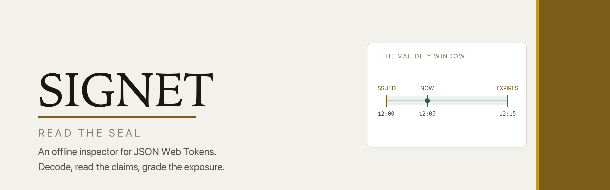
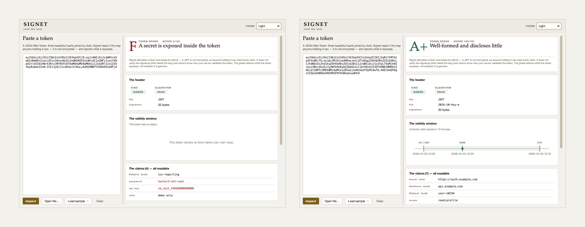

<div align="center">


<picture>
  <source media="(prefers-color-scheme: dark)" srcset="images/banner-dark.png">
  
</picture>

<br>

**An offline inspector for JSON Web Tokens that decodes a token, draws its
validity window, shows every claim it exposes, and grades what it finds —
without ever verifying the signature or calling a token safe.**

<br>


**[Signet project site](https://at0m-b0mb.github.io/Signet-JWT-Inspector/)**

</div>

---

## Why

A JWT looks like a secret. It is long, it is opaque, it rides in an
`Authorization` header — so people file it in memory next to passwords and API
keys. It is not a secret. It is a sealed letter: the seal proves who sent it,
and anyone holding the letter reads every word.

The middle third of a token is plain base64url. Paste it into Signet and it
turns back into JSON — in front of you, and in front of anyone who intercepts
the token, logs it, or finds it sitting in a browser's local storage.

Signet shows you three things at once:

- **The validity window** — `iat`, `nbf` and `exp` drawn on one time axis, the
  valid span shaded, and *now* marked inside the band, before it, or past it.
- **Every claim, in full** — registered claims labelled, NumericDates written as
  readable moments, anything that looks like a secret in red and personal data
  in amber.
- **The weaknesses** — `alg: none`, a shared-secret signature, no expiry or a
  seven-day one, no audience, a `kid` shaped like a path-traversal probe.

Then it grades the token A+ to F, and shows what each finding cost.

<div align="center">
<picture>
  <source media="(prefers-color-scheme: dark)" srcset="images/screens-dark.png">
  
</picture>
<br>
<sub>A service token carrying <code>password</code> and <code>api_key</code> in the clear (F, 2/100), beside a fifteen-minute access token with <em>now</em> inside its window (A+, 100/100).</sub>
</div>

## The honest part

Signet **never verifies the signature**. That needs the key, and Signet has no
key and no network. It also cannot know how your server validates a token —
which algorithms it accepts, whether it checks the audience, whether it looks at
`exp` at all. So a high grade means the token is well-formed and discloses
little. It never means the token is genuine, and the word "safe" appears nowhere
in a result.

- **`alg: none` is always F**, whatever else the token does right. A server that
  accepts an unsigned token trusts one anyone can type out by hand.
- **A secret in a claim caps the grade at D.** One password in the open is worth
  more to an attacker than everything else the token got right.
- **An expired token is a note, not a fault.** Rejecting it is the server's job;
  Signet reports where *now* falls and leaves the grade alone.
- **A JWE scores A and stops there.** Its claims are ciphertext — good for you,
  and the reason Signet cannot read them either.

## Install

```bash
git clone https://github.com/at0m-b0mb/Signet-JWT-Inspector.git
cd Signet-JWT-Inspector
python3 -m pip install -r requirements.txt   # just PyQt6, for the window
```

The engine and the command line need **no dependencies** — only the standard
library. PyQt6 is required solely for the graphical inspector.

## Use

**The window:**

```bash
python3 -m signet          # or:  python3 run.py
```

Paste a token on the left and press **Inspect**; or open a `.jwt` file, or pick
one of the four bundled samples. The reading appears on the right: the grade and
its headline, the header's algorithm and signature length, the validity window
drawn on its axis, every claim, then the findings in severity order. **Light**,
**Dark** and **Auto** are in the top-right, and the painted axis repaints with
the palette.

**The command line** — same engine, no Qt, in a pipe or a script:

```bash
python3 -m signet samples/secret-in-claims.jwt       # a readable report
cat token.jwt | python3 -m signet -                  # from a pipe
python3 -m signet token.jwt --json                   # machine-readable
```

A pasted `Authorization: Bearer …` prefix is stripped for you, and the padding a
compact token drops is restored before decoding.

```
  F   A secret is exposed inside the token  (2/100)
Signet decodes a token and reads its claims — a JWT is not encrypted, so anyone
holding it can read every claim. It does not verify the signature (that needs the
key) and cannot know how your server validates the token…

Kind       jws
Algorithm  HS256

Claims (all readable — a JWT is not encrypted)
  sub        svc-reporting
  password   hunter2-not-real
  api_key    sk_test_FAKE0000000000
  note       demo only

Findings (5)
  [ alert ] A secret is sitting in the open -60
          The claim(s) password, api_key look like a secret. Remember a JWT is
          only base64 — anyone who holds it reads this in full…
  [warning] No expiry (exp) -22
  [notice ] Symmetric signature (HS256) -8
  [notice ] No issuer (iss) -4
  [notice ] No audience (aud) -4
```

Exit status is `0` for a reading and `2` when there was nothing to read — an
empty input, or a file that would not open.

## What it checks

Every token starts at 100 and loses points for what it carries. Each loss is a
finding, written so you can act on it.

| Signal | What trips it |
|---|---|
| **Algorithm** | `none` or an empty signature (−70); a shared-secret `HS*` (−8); an alg Signet does not recognise, or none declared (−18) |
| **Expiry** | no `exp` at all (−22); a lifetime over 30 days (−18) or over a day (−8); an `exp` that is not a number (−8) |
| **Not before** | an `nbf` that has not arrived yet (−4) |
| **Identity** | no `iss` to say who minted it (−4); no `aud` to bind it to one service (−4) |
| **Exposure** | a claim name among the 16 that read as a secret (−30 each, to −60); among the 9 that read as personal data (−12) |
| **Header** | a `kid` containing one of 11 path- or query-injection probes (−12) |
| **Shape** | five parts (a JWE, contents unreadable); anything that is not three parts (malformed, graded F) |

A+ is reserved for a token that is asymmetrically signed, names an issuer and an
audience, expires within a day, exposes nothing, and still scores 97 or better.

## Privacy

Signet opens no sockets, resolves no names and fetches no keys. It splits a
string on dots, decodes base64 and parses JSON with the standard library, and
that is the whole of it — a token you paste in never leaves your machine.

The token keeps nothing from whoever you hand it to next. Read it before you do.

## Tests

```bash
python3 -m pip install -r requirements-dev.txt
python3 -m pytest -q
```

152 tests cover the decoder (padding, bearer prefixes, JWE, `alg: none`,
malformed input), the claim interpreter, and the whole grading pipeline against
the sample set. 118 of them are the contrast suite: every text colour on every
ground it can land on, and every severity badge on its own wash, held to WCAG AA
in both themes, so the palette cannot quietly regress.

## Layout

```
signet/
  core/            the engine — pure standard library, no Qt
    model.py         the dataclasses everything speaks in
    decode.py        split, unpad, base64url-decode, parse
    claims.py        registered claims, NumericDates, exposure hints
    inspect.py       findings and the letter, with the honesty ceiling
  ui/
    theme.py         the design system: one place for every colour
    validity.py      the validity window — Signet's signature element
    widgets.py       cards, chips, key/value rows
    main_window.py   the inspector itself
  cli.py           the same engine on the command line
  app.py           the Qt bootstrap
  __main__.py      python -m signet — window, or CLI if given a file
samples/           four fabricated tokens: clean, alg:none, secret, PII
tests/             152 tests, 118 of them contrast
tools/             gen_samples.py, capture_screenshots.py, brandkit.py
images/            marks, banners, screenshots, social card
run.py             open the window
```

## Colophon

Set in **Iowan Old Style** for identity, the system **sans** for anything you
read, and a **mono** for the token and its claims. Warm paper and two golds in
the light theme — a deep brass that carries words, a brighter shine that never
does; true black in the dark, with nothing in the ramp that reads as blue. Every
colour is declared as a light/dark pair, and the contrast suite holds every
pairing to WCAG AA.

## License

MIT — see [LICENSE](LICENSE). A reader, for authorised, educational and personal
use. Every token in `samples/` is fabricated: the signatures are random bytes
and nothing authenticates anything.
